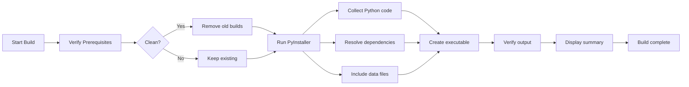

# Build Pipeline Summary

## Quick Reference

### Build Commands
```powershell
# PowerShell
.\build.ps1                    # Standard build
.\build.ps1 -clean            # Clean and rebuild
.\build.ps1 -debug            # Debug with verbose logging

# Command Prompt
build.bat                      # Standard build
build.bat clean               # Clean and rebuild
build.bat debug               # Debug build
```

### Build Output
- **Location**: `dist/MonitorAI.exe`
- **Size**: ~200-300 MB (includes Python runtime, dependencies, and model)
- **Startup time**: 3-5 seconds
- **Dependencies**: Visual C++ Redistributable required

## What's Included

| Component | Size | Purpose |
|-----------|------|---------|
| Python runtime | ~50 MB | Python interpreter |
| Dependencies | ~100 MB | All pip packages |
| GGML model | ~3.8 GB | Local LLM |
| Application code | ~5 MB | Monitor-AI source |

## Build Files

```
project/
├── MonitorAI.spec              ← PyInstaller configuration
├── build.ps1                   ← PowerShell build script
├── build.bat                   ← Batch build script
├── build.cfg                   ← Build configuration
├── BUILD.md                    ← Detailed build documentation
├── hooks/
│   └── hook-paddleocr.py      ← PyInstaller hook for PaddleOCR
├── .github/workflows/
│   └── build.yml               ← GitHub Actions CI/CD
└── dist/
    └── MonitorAI.exe           ← Output executable
```

## Prerequisites

- [ ] Python 3.9+ installed
- [ ] Virtual environment activated: `.\.venv\Scripts\Activate.ps1`
- [ ] Dependencies installed: `pip install -r requirements.txt`
- [ ] PyInstaller installed: `pip install pyinstaller`
- [ ] Model file downloaded: `models/mistral-7b-instruct.Q4_0.ggmlv3.bin`
- [ ] Visual C++ Redistributable (for running on target machines)

## Build Process



## Features

✅ **One-file executable** - Single distributable file  
✅ **PaddleOCR included** - No additional OCR installation  
✅ **Local LLM** - Mistral-7B included and ready  
✅ **Cross-monitor support** - Runs on any Windows 10/11  
✅ **Debug mode** - Build with verbose logging  
✅ **CI/CD ready** - GitHub Actions workflow included  
✅ **No Python required** - Runs independently  

## Common Tasks

### Fresh Build
```powershell
.\build.ps1 -clean
```

### Debug Build
```powershell
.\build.ps1 -clean -debug
```

### Test Executable
```powershell
cd dist
.\MonitorAI.exe
```

### Check Build Size
```powershell
(Get-Item "dist/MonitorAI.exe").Length / 1MB
```

### Clean Build Artifacts
```powershell
Remove-Item -Recurse -Force build, dist
```

## Troubleshooting

| Issue | Solution |
|-------|----------|
| Build fails - module not found | Check `MonitorAI.spec` hidden_imports |
| Executable won't run | Install Visual C++ Redistributable |
| Build too slow | Use SSD, more RAM, or directory distribution |
| File too large | Exclude model, use compression, or directory distribution |
| "Permission denied" | Close dist/ files, try clean build |

See [BUILD.md](BUILD.md) for detailed troubleshooting.

## Advanced Options

### Exclude Model (Smaller Executable)
Edit `MonitorAI.spec` and remove model from `datas`:
```python
datas=paddleocr_datas + screeninfo_datas + [
    # ('models', 'models'),  # Comment out to exclude
    ('hooks', 'hooks'),
]
```

### Add Application Icon
1. Place `icon.ico` in project root
2. Rebuild - it will be automatically detected

### Code Signing
```powershell
# Requires certificate
signtool sign /f cert.pfx /p password dist/MonitorAI.exe
```

### UPX Compression
Install UPX and enable in `build.cfg`:
```cfg
compression = upx
upx_enabled = true
```

## Distribution

After building and testing:

1. **Verify executable works on clean Windows 10/11**
2. **Create distribution package**:
   ```powershell
   mkdir MonitorAI-release
   Copy-Item dist/MonitorAI.exe MonitorAI-release/
   Copy-Item README.md MonitorAI-release/
   Copy-Item DEPENDENCIES.md MonitorAI-release/
   ```
3. **Create installer** (optional - use NSIS or Inno Setup)
4. **Upload to release channel** (GitHub, website, etc.)

## GitHub Actions CI/CD

Automatic builds on push/pull-request:
- Builds on Python 3.10 and 3.11
- Uploads artifacts for 30 days
- Creates GitHub release on tag push
- Security scanning integration

To use: Push to GitHub with `.github/workflows/build.yml`

## Performance

| Metric | Value |
|--------|-------|
| Build time | 5-10 minutes (first), 2-5 min (incremental) |
| Executable size | 200-300 MB |
| Startup time | 3-5 seconds |
| First run setup | 5-10 seconds (extracts to temp) |
| OCR + LLM inference | 5-10 sec (CPU) / 1-2 sec (GPU) |

## Next Steps

1. **Build executable**: `.\build.ps1 -clean`
2. **Test thoroughly**: `dist\MonitorAI.exe`
3. **Verify on clean machine**: Test on Windows without dev environment
4. **Create release**: Upload to distribution channel
5. **Document version**: Update `MonitorAI.spec` with version info

## Support

For issues:
1. Check [BUILD.md](BUILD.md) troubleshooting section
2. Check [DEPENDENCIES.md](DEPENDENCIES.md) for system requirements
3. Enable debug mode: `.\build.ps1 -debug`
4. Review PyInstaller logs in `build/` directory
